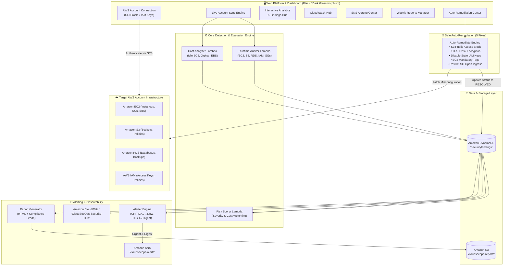

# 🛡️ CloudSecOps - Enterprise Cloud Security, Audit & Auto-Remediation Platform

[](https://github.com/sharanaprabhuty/CloudSecOps/actions)
[](https://www.python.org/)
[](https://aws.amazon.com/)
[](LICENSE)

An end-to-end, full-stack **Cloud Security Operations & Compliance Platform** built on AWS. It enables cloud engineers and security teams to connect their AWS accounts, continuously scan infrastructure across **EC2, S3, RDS, IAM, and VPC Security Groups**, calculate risk scores, generate CloudWatch metric dashboards, dispatch severity-routed SNS alerts, produce executive HTML audit reports, and safely auto-remediate misconfigurations with 1 click.

---

## 🏗️ Architecture Overview



---

## ✨ Key Features & Capabilities

### 1. 🔑 AWS Account Connection & Dynamic Sync (Core Workflow)
- **Zero Friction Authentication**: Connect to any AWS account using an existing local **AWS CLI Profile** (`cloudsecops`, `default`) or **Direct IAM Credentials** (Access Key ID, Secret Key, Session Token, Region).
- **STS Identity Verification**: Automatically resolves `Account ID`, `User ARN`, `Session Role`, and `Region`.
- **Live Pipeline Synchronization**: With one click, runs a synchronized 6-stage scan across the entire infrastructure.

### 2. 🔍 Multi-Service Runtime Security Auditor
- **Amazon S3**: Detects public buckets lacking Public Access Block settings and unencrypted buckets lacking default server-side encryption (SSE-AES256).
- **Amazon EC2**: Identifies instances with direct public IP exposure and instances missing mandatory organizational tags (`Environment`, `Owner`).
- **Amazon RDS**: Flags databases without storage encryption and databases with automated backup retention under 7 days.
- **AWS IAM**: Scans active access keys and flags keys older than 90 days.
- **VPC Security Groups**: Identifies insecure ingress rules exposing sensitive administration ports (`Port 22 SSH`, `Port 3389 RDP`) to the public internet (`0.0.0.0/0`).

### 3. 💰 Cloud Cost Optimization Analyzer
- Identifies idle running EC2 instances with average 7-day CPU utilization under 5%.
- Identifies unattached (orphan) EBS volumes incurring redundant storage costs.
- Calculates estimated monthly cost savings in dollars.

### 4. 📊 Multi-Factor Risk Scoring Engine
- Computes comprehensive risk scores (0–100) based on severity weights:
  - `CRITICAL`: 40 points
  - `HIGH`: 25 points
  - `MEDIUM`: 10 points
  - `LOW`: 5 points
- Dynamic boosts for sensitive resource exposure (S3, IAM, Security Groups: +20 points) and cost waste (+15 points).

### 5. 📧 Severity-Based SNS Alerting
- **Intelligent Routing**:
  - `CRITICAL` findings trigger **immediate real-time alerts** with high-visibility formatting and resource links.
  - `HIGH` findings generate an **aggregated digest summary** grouped by resource type.
  - `MEDIUM` & `LOW` findings are logged to CloudWatch and DynamoDB.
- Self-service email subscription and one-click test alert verification in the UI.

### 6. 📈 CloudWatch Security Hub Dashboard
- Deploys real-time metric widgets to Amazon CloudWatch:
  - Security Findings by Severity (Time Series)
  - Compliance Health Score % (Single Value Gauge)
  - Estimated Monthly Cost Savings (Single Value)
  - Auto-Remediation & Resolution Status (Bar Chart)
  - Flaws Breakdown by AWS Service (Time Series)
- Direct link into the AWS Management Console (`ap-south-1`).

### 7. 📄 Weekly Executive HTML Audit Reports
- Generates polished, standalone, dark-themed HTML executive reports.
- Features Security Health Letter Grades (`Grade A` to `Grade F`) and Compliance Score percentage.
- Comprehensive breakdown of findings, cost savings, and actionable executive recommendations.
- Stores reports locally in `reports/` and uploads to S3 bucket (`cloudsecops-reports-<account_id>`).
- Built-in preview modal and one-click download.

### 8. 🔧 5 Safe Auto-Remediations
Enforces safe, zero-downtime automated fixes without service disruption:
1. `fix_s3_block_public_access`: Enables all 4 S3 Public Access Block settings.
2. `fix_s3_encryption`: Enforces AES256 Default SSE on S3 buckets.
3. `fix_old_iam_key`: Deactivates stale IAM access keys older than 90 days.
4. `fix_ec2_missing_tags`: Injects mandatory `Environment` and `Owner` tags to EC2 instances.
5. `fix_open_security_group`: Revokes 0.0.0.0/0 ingress on SSH (port 22) and RDP (port 3389).
- Supports both **1-Click Single Finding Fix** in the findings table and **Bulk Auto-Remediation**.

---

## 🚀 Quickstart Guide

### Prerequisites
- Python 3.11+
- AWS Account with AWS CLI configured (or IAM credentials)
- Active DynamoDB table `SecurityFindings` (Primary Key: `finding_id` [String], Sort Key: `timestamp` [String])

### Installation

1. **Clone the repository**:
   ```bash
   git clone https://github.com/sharanaprabhuty/CloudSecOps.git
   cd CloudSecOps
   ```

2. **Create and activate virtual environment**:
   ```bash
   python -m venv venv
   # Windows:
   .\venv\Scripts\activate
   # Linux/macOS:
   source venv/bin/activate
   ```

3. **Install dependencies**:
   ```bash
   pip install -r dashboard_requirements.txt
   pip install -r requirements.txt
   ```

4. **Launch the CloudSecOps Dashboard**:
   ```bash
   python app.py
   ```
   Open your browser at **`http://localhost:5000`**.

5. **Connect your AWS Account**:
   - In the top banner, select your active AWS profile (`cloudsecops` or `default`) or input your IAM Access Key & Secret Key.
   - Click **Connect & Sync Account**.
   - Your account findings, compliance grade, CloudWatch widgets, and reports will populate automatically!

---

## 🧪 Running Automated Tests

Run the complete pipeline test suite:
```bash
python -m unittest tests/test_full_pipeline.py
```
Or run with pytest:
```bash
pytest tests/test_full_pipeline.py -v
```

---

## 📋 REST API Reference

| Endpoint | Method | Description |
| :--- | :---: | :--- |
| `/api/account-info` | `GET` | Returns active account ID, IAM identity, region, and sync status |
| `/api/connect-aws` | `POST` | Authenticates and connects AWS account via profile or keys |
| `/api/disconnect-aws` | `POST` | Disconnects the current AWS session |
| `/api/sync-account` | `POST` | Executes full end-to-end sync scan and updates all metrics |
| `/api/findings` | `GET` | Fetches all detected security findings from DynamoDB |
| `/api/summary` | `GET` | Summary statistics, severity breakdown, compliance score, and savings |
| `/api/cloudwatch/preview` | `GET` | Returns CloudWatch dashboard schema and AWS console URL |
| `/api/cloudwatch/deploy` | `POST` | Deploys/updates CloudWatch dashboard widgets in AWS |
| `/api/sns/status` | `GET` | Returns SNS topic ARN and subscriber list |
| `/api/sns/subscribe` | `POST` | Subscribes an email to security alert notifications |
| `/api/sns/test` | `POST` | Dispatches a sample security alert email |
| `/api/trigger-report` | `POST` | Generates a new executive HTML report |
| `/api/reports` | `GET` | Lists all generated audit reports |
| `/api/reports/download/<file>` | `GET` | Downloads specified HTML report |
| `/api/reports/preview/<file>` | `GET` | Opens report preview |
| `/api/remediate-finding/<id>` | `POST` | Safely remediates a single specific finding |
| `/api/trigger-auto-remediate` | `POST` | Runs auto-remediation engine for all eligible findings |

---

## 🛡️ License & Authors
Developed by **Sharanaprabhu** for advanced Cloud Security Operations & DevSecOps Engineering. 
